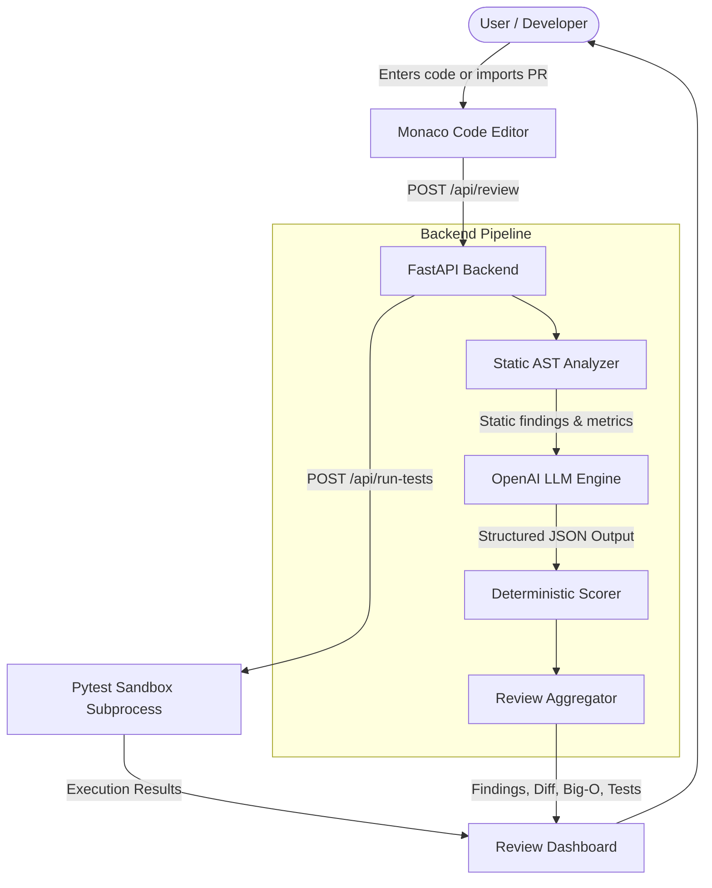

# AI Code Reviewer & Debugging Assistant

An intelligent code analysis and debugging platform that combines static AST verification, automated test execution, and LLM-assisted code reviews. The application analyzes source code for security vulnerabilities, runtime bugs, and algorithmic complexity bottlenecks, providing line-level remediation, refactoring diffs, and executable test suites.
## Deployment Link
https://ai-code-reviewer-sigma-nine.vercel.app/

## Overview

Code reviews often require checking both mechanical issues (syntax errors, resource leaks, credential leaks) and complex contextual issues (architectural patterns, race conditions, edge-case failure modes). 

This application provides a structured developer dashboard for code review and optimization. Rather than acting as an open-ended conversational bot, it employs a hybrid review pipeline:

1. **Static AST Analysis**: Extracts mechanical flaws (unhandled exceptions, nesting depth, insecure calls) and complexity metrics.
2. **Context-Augmented LLM Review**: Feeds static findings and source code into OpenAI models (`gpt-4o`, `gpt-4o-mini`, `o1-preview`) using structured JSON schemas.
3. **Deterministic Scoring**: Calculates categorical and overall health scores based on finding severity deductions.
4. **Sandboxed Verification**: Allows developers to execute generated unit tests locally via `pytest` to verify runtime behavior.

The tool is intended for developers, technical leads, and students preparing for technical reviews who require quick, structured audits of source code snippets or pull requests.

## Key Features

### Code Analysis & Static Checks
- **Python AST Visitor**: Parses Python source trees to detect dangerous function calls (`eval`, `exec`), unclosed file descriptors (`open` without `with`), and bare `except:` clauses.
- **Complexity Metrics**: Computes cyclomatic complexity and maximum loop nesting depth.
- **Deterministic Health Scoring**: Uses a mathematical penalty deduction model (Critical: -20, Warning: -10, Optimization: -4) instead of arbitrary qualitative scores.

### Security Analysis
- Detection of SQL injection patterns (dynamic query concatenation and unparameterized string formatting).
- Detection of plaintext hardcoded credentials and API secrets in source files.
- Detection of error stack trace exposure to client responses.

### Performance & DSA Complexity Profiler
- **Big-O Analysis**: Dedicated profiling of Time Complexity (e.g., $O(n^2)$), Space Complexity (e.g., $O(n)$), and Target Optimal Complexity ($O(n+m)$).
- **Bottleneck Identification**: Pinpoints specific nested loops and inefficient linear scans, suggesting hash map/set lookups.

### Refactoring & Diff Viewer
- Generates secure and optimized refactored source code.
- Interactive line diff viewer (`diff` library) displaying color-coded additions and deletions with a 1-click "Apply to Editor" action.

### Automated Test Generation & Execution
- Generates test suites targeting edge cases, boundaries, and input validation.
- **Python Test Runner**: Executes Python test code against the source code in a temporary directory using `pytest`, returning real pass/fail counts, execution time, and error tracebacks.

### Interactive Follow-Up
- Contextual question-and-answer functionality on specific findings (e.g., "Why is this dangerous?", "How to test this?").

### Multi-Language Support
- **Monaco Code Editor** with syntax highlighting for JavaScript, TypeScript, Python, SQL, Java, C++, Go, Rust, HTML, and JSON.

### Reporting & Integrations
- Export review summaries to Markdown (`.md`) and structured JSON (`.json`).
- Import changed files and patches directly from public GitHub Pull Request URLs.
- **Client & Server Fallback**: Built-in heuristic engine provides basic reviews when working offline or without an active API key.

## How It Works



### Architecture Breakdown
- **Frontend**: Vite + React single-page desktop application featuring Monaco Editor, tabbed review panes, and diff comparison.
- **Backend**: FastAPI (Python) REST API coordinating AST analysis, LLM prompt orchestration, and GitHub API interactions.
- **Test Execution Layer**: Isolated Python subprocess invoking `pytest` with a 5-second execution timeout guard.
- **LLM Layer**: OpenAI API (`gpt-4o` default) utilizing structured JSON response enforcement.
- **Fallback Layer**: Client-side and server-side rule engines to allow local demonstrations without requiring an external API key.

## Technology Stack

| Technology | Purpose |
| :--- | :--- |
| **React 18** | UI component architecture and state management |
| **Vite** | Frontend build tooling and local development server |
| **Monaco Editor** | Code editing, line gutters, and multi-language syntax highlighting |
| **FastAPI** | High-performance Python backend REST API |
| **Uvicorn** | ASGI web server implementation for FastAPI |
| **Python AST** | Abstract Syntax Tree parsing and static code analysis |
| **Pytest** | Automated test suite execution in temporary subdirectories |
| **OpenAI API** | LLM analysis engine for deep code review and test generation |
| **HTTPX** | Async HTTP client for OpenAI and GitHub REST API integration |
| **diff** | Text diffing algorithm for line-by-line refactor comparison |
| **Lucide React** | Minimal UI icons |

## Project Structure

```
ai-code-reviewer/
├── backend/
│   ├── analyzers/
│   │   └── ast_analyzer.py      # Python AST visitor & static rule engine
│   ├── services/
│   │   ├── github_service.py    # Public GitHub PR diff retrieval
│   │   ├── llm_service.py       # OpenAI prompt chain & deterministic scoring
│   │   └── test_runner.py       # Subprocess pytest runner
│   ├── main.py                  # FastAPI application & API route definitions
│   └── requirements.txt         # Python backend dependencies
├── src/
│   ├── components/
│   │   ├── ApiKeyModal.jsx      # API key and custom guideline settings
│   │   ├── CodeEditor.jsx       # Monaco editor with line counters and toolbar
│   │   ├── ComplexityCard.jsx   # DSA Time/Space complexity visualization
│   │   ├── DiffViewer.jsx       # Side-by-side refactoring diff component
│   │   ├── ExportModal.jsx      # Markdown and JSON export dialog
│   │   ├── GitHubPrModal.jsx    # GitHub PR URL importer dialog
│   │   ├── Header.jsx           # Top navigation and service status indicator
│   │   ├── ReviewPanel.jsx      # Findings, severity filters, test runner UI
│   │   └── ScoreGauge.jsx       # Metric progress bars and health score ring
│   ├── data/
│   │   └── sampleSnippets.js    # Pre-configured test code scenarios
│   ├── services/
│   │   ├── aiService.js         # Client-side heuristic review fallback
│   │   └── apiClient.js         # REST client communicating with FastAPI
│   ├── styles/
│   │   └── index.css            # Design system, variables, and typography
│   ├── App.jsx                  # Main application layout and state orchestration
│   └── main.jsx                 # React root mount point
├── .env.example                 # Example configuration for environment variables
├── index.html                   # HTML entry point with Inter font definitions
├── package.json                 # Node dependencies and build scripts
└── vite.config.js               # Vite bundler configuration
```

## Getting Started

### Prerequisites
- **Node.js**: v18.0.0 or higher
- **Python**: v3.10 or higher
- **npm** or **yarn**

### Installation

1. **Clone the repository**:
   ```bash
   git clone https://github.com/your-username/ai-code-reviewer.git
   cd ai-code-reviewer
   ```

2. **Set up the Python backend**:
   ```bash
   python3 -m venv .venv
   source .venv/bin/activate
   pip install -r backend/requirements.txt
   ```

3. **Set up frontend dependencies**:
   ```bash
   npm install
   ```

4. **Configure Environment Variables**:
   ```bash
   cp .env.example .env
   ```
   *(Optional)* Add your `OPENAI_API_KEY` to `.env` to enable live LLM review. If omitted, the application will use the built-in heuristic engine.

### Running the Application

1. **Start the FastAPI backend** (runs on port 8000):
   ```bash
   ./.venv/bin/uvicorn backend.main:app --port 8000
   ```

2. **Start the frontend development server** (in a separate terminal):
   ```bash
   npm run dev
   ```

3. Open **`http://localhost:5173`** in your browser.

### Building for Production

To create an optimized production build of the frontend:
```bash
npm run build
```
Built assets will be output to the `dist/` directory.

## Environment Variables

| Variable Name | Description | Required |
| :--- | :--- | :--- |
| `OPENAI_API_KEY` | OpenAI API key used for generating code reviews and unit tests | Optional (defaults to heuristic fallback if unset) |
| `PORT` | Port on which the FastAPI server listens (default: `8000`) | Optional |

> **Note on Client-Side Key Configuration:** The UI also provides a modal allowing users to supply an API key directly in the browser. Keys entered via the UI are stored strictly in `localStorage` and sent over the local request payload. For production deployments, storing keys server-side via environment variables is recommended.

## Usage

1. **Input Code**: Type, paste, or upload source code into the Monaco Editor, or select a pre-loaded sample from the **Load Sample** dropdown.
2. **Select Language**: Choose the source language from the language selector to configure editor syntax highlighting.
3. **Run Review**: Click **Run Review**. The backend executes static analysis and LLM inspection.
4. **Inspect Findings**: Review the overall health score, Big-O complexity breakdown, and categorized issue cards (Critical, Warning, Optimization).
5. **Interactive Q&A**: Click quick prompts (e.g., *"Why is this dangerous?"*) or enter custom questions under any finding card.
6. **Evaluate Refactoring**: Switch to the **Refactor Diff** tab to inspect additions/deletions and apply fixes directly back to the editor.
7. **Execute Tests**: Switch to the **Unit Tests** tab and click **Run Tests** to verify behavior via the local `pytest` runner.
8. **Export**: Click **Export** in the top bar to download or copy a Markdown or JSON report.

## Example

### Input Code (Python)
```python
def find_common_purchases(customer_orders_file, catalog_file):
    orders_data = json.load(open(customer_orders_file))
    catalog_data = json.load(open(catalog_file))
    
    common_items = []
    for order in orders_data:
        for item in order.get("items", []):
            item_id = item.get("id")
            for product in catalog_data.get("products", []):
                if product.get("id") == item_id:
                    if item_id not in [x["id"] for x in common_items]:
                        common_items.append({"id": item_id, "price": product.get("price")})
    return common_items
```

### Analysis Output (Illustrative)
- **Health Score**: `78/100` (Needs Work)
- **Time Complexity**: $O(n^2)$ (Quadratic scan across nested loops)
- **Target Complexity**: $O(n + m)$ (Indexed dictionary lookup)
- **Detected Issues**:
  - `[WARNING]` **Unclosed File Descriptor**: Files opened without `with open(...)` context manager.
  - `[OPTIMIZATION]` **Nested Loop Bottleneck**: Nested linear scanning across catalog products.
- **Suggested Fix**:
  ```python
  with open(customer_orders_file, 'r', encoding='utf-8') as f:
      orders_data = json.load(f)
  catalog_map = {p["id"]: p for p in catalog_data.get("products", [])}
  ```

## Code Analysis Categories

- **Security**: Identifies injection risks, hardcoded credentials, and sensitive data leakage.
- **Performance / DSA**: Evaluates algorithmic complexity (Big-O), loop nesting depth, and resource lifecycle management.
- **Maintainability & Correctness**: Checks exception handling hygiene, variable scopes, and language idioms.
- **Readability**: Analyzes structural clarity, naming conventions, and documentation.
- **Testability**: Evaluates modularity and edge-case test coverage.

## Security Considerations

- **API Key Storage**: Client-entered keys remain in the browser's `localStorage` and are transmitted directly to the local backend. Server-side keys are read from `.env` and are never exposed to the client.
- **Subprocess Isolation**: The Python test runner executes generated tests in temporary directories (`tempfile.TemporaryDirectory`) with a strict 5.0-second execution timeout to prevent infinite loops.
- **Arbitrary Code Execution**: The application only executes code when the user explicitly clicks **Run Tests**. It does not automatically run unvetted code on paste or upload.

## Limitations

- **LLM Hallucinations**: LLM suggestions may occasionally propose non-idiomatic code or incorrect imports; outputs should always be reviewed before production deployment.
- **Test Runner Scope**: Automated test execution via `pytest` is currently implemented for Python code.
- **Static Analysis Depth**: AST checks focus on common vulnerability and quality patterns and do not replace full commercial static analysis platforms (e.g., SonarQube, Snyk).
- **Public GitHub Rate Limits**: Unauthenticated GitHub PR imports are subject to standard GitHub API IP rate limits.

## Future Improvements

- Integration with static analysis CLI tools (`ruff`, `eslint`, `clang-tidy`) directly within the backend pipeline.
- Dockerized container sandboxes (e.g., gVisor / nsjail) for multi-language isolated test execution.
- Multi-file project workspace analysis and repository-wide dependency graph inspection.
- Automated GitHub Actions workflow to post review comments directly onto Pull Requests.
- Support for local LLM inference engines (e.g., Ollama, vLLM).

## Development

### Adding a New Analysis Rule
To add a new static check for Python:
1. Open `backend/analyzers/ast_analyzer.py`.
2. Implement a new visitor method in `SecurityAndQualityVisitor` (e.g., `visit_Import`, `visit_Assign`).
3. Append finding objects to `self.findings`.

### Modifying Review Prompts
To adjust the structured LLM system prompts:
1. Open `backend/services/llm_service.py`.
2. Update `system_prompt` in `_call_openai_review` to modify output fields or instructions.

## License

License information has not been specified.
